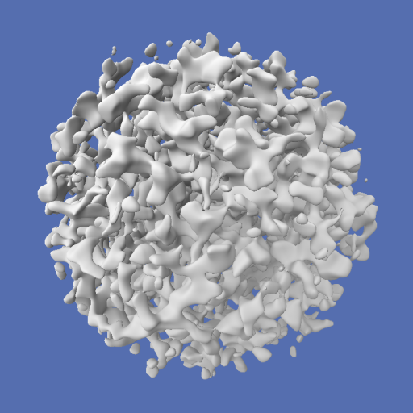
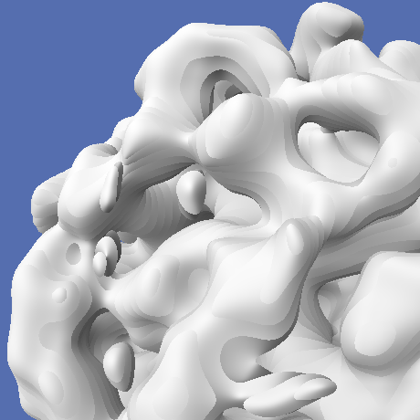
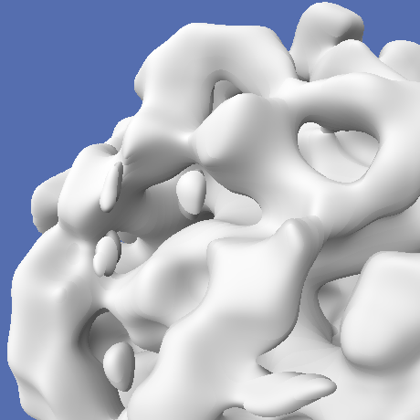
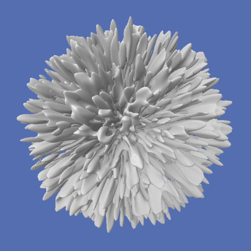
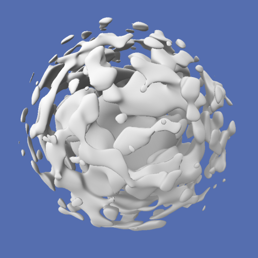

# ray-marching-webgl

## Description
This project is a simple experiment combining ray marching and noise generation in three or four dimensions.

See it live [here](https://piellardj.github.io/ray-marching-webgl/).

## Details

### Ray marching

Ray marching requires a signed function to define the exterior and interior of the displayed object. In this project, I use a ℝ3 ⟼ ℝ or ℝ4 ⟼ ℝ noise field. The noise output is is [-0.5,+0.5] (shifted when changing the density parameter). The displayed isosurface is the one formed by the points where the noise is 0: positive values are ouside the object, negative lower are inside it.

Using noise fields gives interesting results visually, however it is very costly performance-wise because there is no nice formula to describe such a field. It is quite heavy to evaluating it for each step of each ray.

#### Intersection computing
For simplicity, I chose to use a constant step size for the ray marching. Indeed, the noise fields I use are not exactly signed distance functions because they lack an interesting property: the value at a given point is not equal to the distance to the isosurface. However, I could have used an  adaptative step size because the noise fields are continuous enough and their gradient is bounded. Given the scale of the noise and the local deformation of space, it is certainly possible to compute this bound.

#### Normal computing
The normal is computed by taking 3 samples around the point, to compute the local gradient.

Since I take large constant-sized steps for the ray-marching, the rays often end up being quite far from the actual surface. This leads to discontinuities in the computed normals. Moreover these discontinuities are relative to the screenspace, so they appear to be moving when moving the camera, which is distracting.

To mitigate this issue, just before computing the normal, I do a little more ray-marching, this time using baby adaptative steps to try to get a bit closer to the surface. Using only 10 steps gives a satisfying result at an acceptable cost. However, sometimes there are still a few artifacts left.

*Without normal smoothing, the step size create displeasing discontinuities.*

*With normal smoothing, these discontinuities are mostly hidden, except in places where the ray is too far away from the real surface.*

### Noise types
This project supports 3 types of noise: value noise, gradient noise and a simplex-like noise. Their different properties can be used to create various effects:
- value noise is computed by creating evenly-spaced points on the natural space-grid, evaluating a scalar value on each of those points and simply interpolating between them to fill the space. The result is very geometric and one can clearly see the underlynig grid. It almost looks like plumbing
- gradient noise also uses points along the grid. However, contrarily to value noise, it is a vector value that is computed on each point. Then the influence of each point is computed using dot product, and the result is interpolated. Gradient noise is way more rounded, organic and natural than value noise. It is a tiny bit more heavy to compute.
- simplex noise uses the same basic idea as gradient noise, however it doesn't use a euclidian grid: for instance, in 2D it uses triangles instead of squares, in 3D pyramids instead of cubes etc. It is theoretically way faster than gradient noise because it only requires evaluating and interpolating between 4 points instead of 8. It is supposed to look smoother than gradient noise, mostly because it doesn't use a square grid structure. I didn't implement it myself but borrowed it from other projects. I have to admit that I am a bit disappointed because the hexagonal structure is quite visible (especially for the 4D code). I supposed it is due to the implementation being over-simplified for performanced reasons.

### Deformation
To further explore the noise properties, a deformation can be applied to either dilate or contract space around the center of the sphere.

*Squeezing deformation*

*Dilatation deformation*

### Animation
There are two animation modes that both allow for smooth continuous changes:
- the 4D mode, in which the noise field is 4-dimensional, the fourth dimension being time. This creates the unsettling impression of witnessing an otherwordly object crossing our dimension.
- the 3D mode, which is cheaper since it only requires a 3-dimensional noise field. The time is simply used to translate the coordinates. This creates a pleasant flow effect.